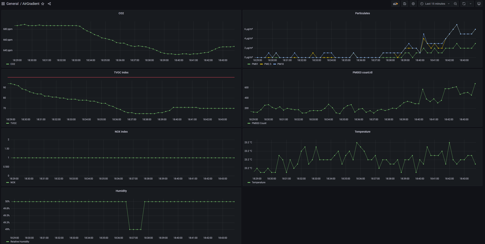

# airgradient-pro-prometheus-pushgateway

AirGradient Pro v4.2 Arduino Sketch to track metrics to a Prometheus Pushgateway.

Here, pushgateway is used to avoid network access problems where the Prometheus server is on a different network, and NAT port forwarding cannot be configured. Prometheus [only recommend](https://prometheus.io/docs/practices/pushing/) using pushgateway for batch jobs. If you don't need to use pushgateway, you should probably use [airgradient-prometheus](https://github.com/geerlingguy/airgradient-prometheus) over this (but it doesn't log the extra Pro sensor fields at time of writing). 

Tested with an HTTPS pushgateway host, possibly needs modifications to work with insecure HTTP.

1. Save certificate chain for your pushgateway domain: `cert.py -s example.com -n pushgateway_domain > certs.h`
1. Follow the [Arduino setup instructions](https://www.airgradient.com/open-airgradient/instructions/basic-setup-skills-and-equipment-needed-to-build-our-airgradient-diy-sensor/) for flashing the AirGradient sensor. Make sure you connect the USB-C cable to the chip - not the power port on the back of the housing.
1. Install the following libraries from the Arduino library manager (Tools -> Manage Libraries):
    - AirGradient Air Quality Sensor (tested with 2.4.7)
    - All the libraries from the [header comment in the code](./AirGradient_Prometheus_DIY_PRO_V4_2.ino)
1. Open the [the code](./AirGradient_Prometheus_DIY_PRO_V4_2.ino) in Arduino Studio.
1. Configure `pushgateway_host` and `prometheus_http_basic_auth` (if desired).
1. Hit Upload in Arduino Studio.
1. Check your monitoring set up is receiving data.
1. `grafana.json` is the model JSON for an example dashboard to visualize this data (screenshot below).

# References

- [Prometheus Client Data Exposition Format](https://docs.google.com/document/d/1ZjyKiKxZV83VI9ZKAXRGKaUKK2BIWCT7oiGBKDBpjEY/edit)
- https://github.com/airgradienthq/arduino/blob/master/examples/DIY_PRO_V4_2/DIY_PRO_V4_2.ino
- https://github.com/geerlingguy/airgradient-prometheus
- https://github.com/esp8266/Arduino/blob/master/tools/cert.py